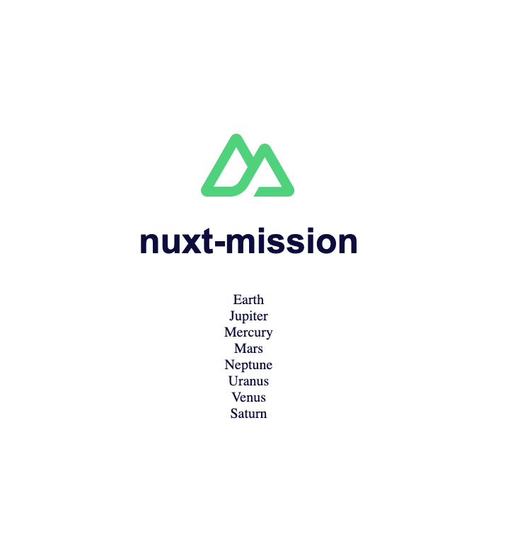

#  :earth_africa: Nuxt Mission

## 👉 Create a list of planets with Nuxt

## Illustration 📸
### 🖥  Desktop illustration
;


## Language & tools 🛠
- HTML5 / CSS3
- Nuxt.js
  

## Goals 🏔
- Discover Nuxt
- Explore Vue via Nuxt
- UX / UI

## How to use 🛠

### ⚙️ Launch the development server & meeting on http://localhost:3000/

### Project setup
```javascript
yarn
```

### Compiles for development
```javascript
yarn run dev
```

### Compiles and minifies for production
```javascript
yarn run build
```

## Status 🎯
Project completed

## Context 🗓
Project developed as a junior web developer
